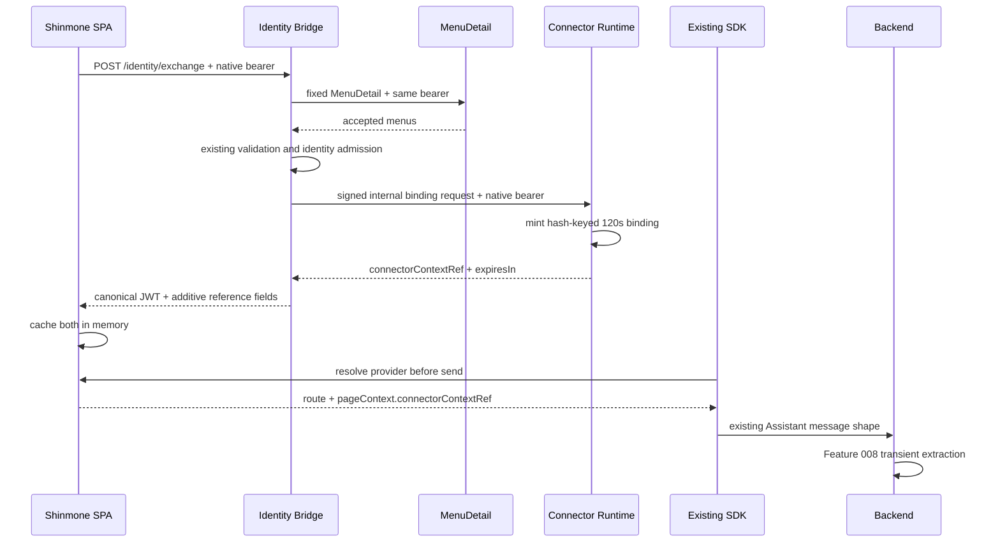
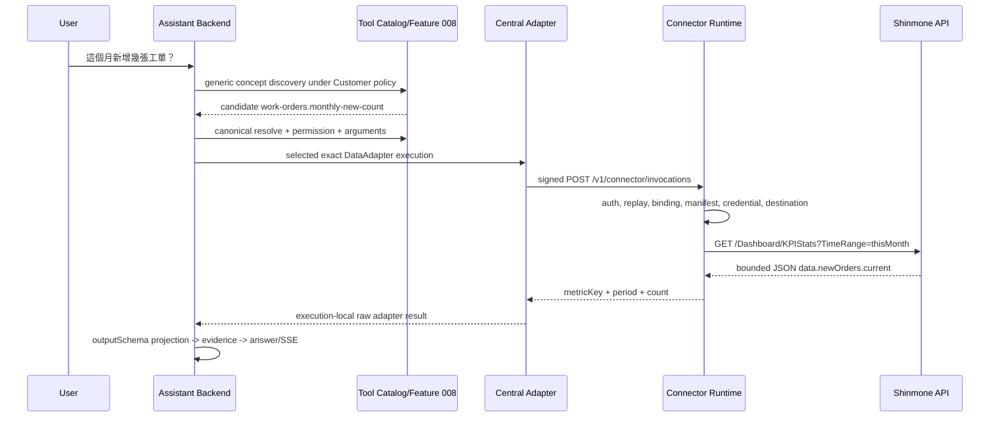
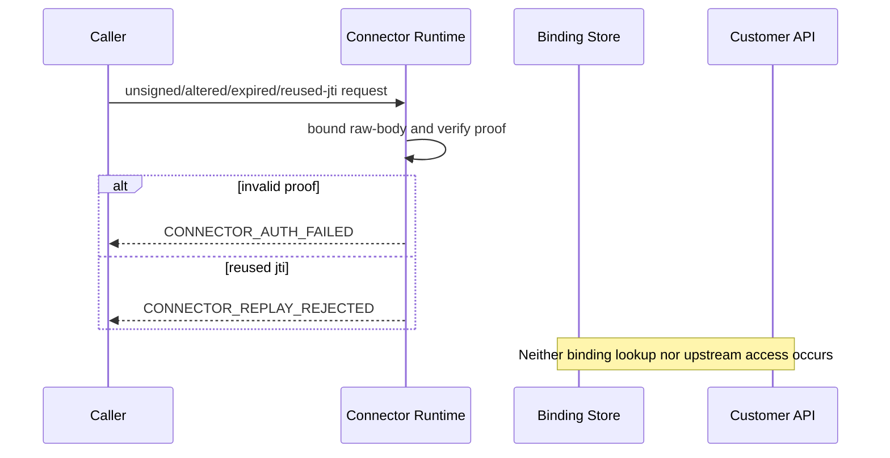
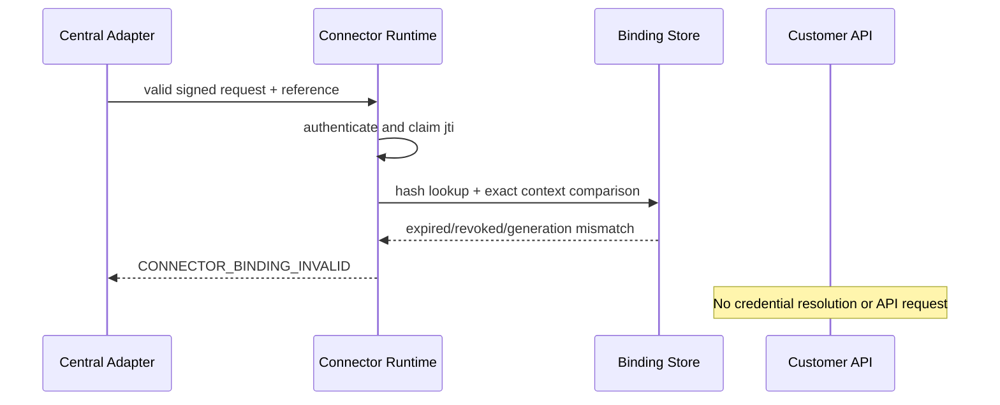
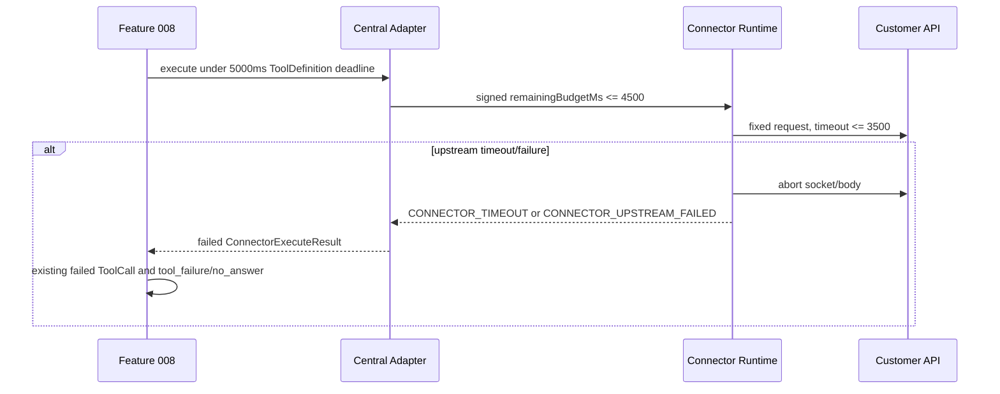
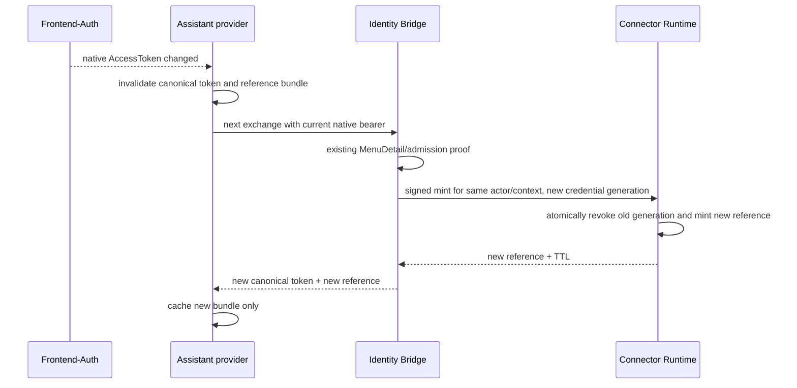

# Feature 009 — Productized Business Connector Runtime Design

**Feature Branch**: `009-productized-business-connector-runtime`  
**Created**: 2026-09-09  
**Source Spec**: [spec.md](./spec.md)  
**Status**: Accepted — Approved for Phase 1 implementation

## 1. Design Goals and Constraints

Feature 009 adds one reusable central-to-Customer connector boundary behind the accepted Feature 008 `DataAdapter` seam. The central Backend selects an exact trusted deployment, sends a signed bounded invocation to an independently deployed Customer-local runtime, and receives a minimized operation result. Feature 008 remains the only permission, operation-contract, projection, evidence, ToolCall, answer, and SSE path.

The design must keep native Customer credentials Customer-side, keep the Browser non-authoritative, execute only manifest-declared named operations, and prevent the transport from becoming a generic HTTP or SQL proxy. It preserves Feature 007/Gateway identity and every accepted Feature 008 public and internal authority contract while consuming the accepted Feature 007 amendment that permits one exact post-admission Customer-local binding handoff.

V1 is portable across Customers through registered Customer-local bootstrap, credential, credential-application, and closed request profiles. It supports only read-only `GET_QUERY_V1` and `POST_QUERY_JSON_V1`. The first reference slice answers `這個月新增幾張工單？` through canonical ToolDefinition `work-orders.monthly-new-count`, but every Shinmone/IDX token, Entry, endpoint, response, Bridge, and SPA detail belongs to a removable integration boundary. Removing that boundary must leave the generic runtime and Synthetic Customer B executable.

## 2. Current Source Findings

The design is grounded in the current Backend, SDK, and Shinmone SPA source.

| Area | Current source finding | Design consequence |
| --- | --- | --- |
| Trusted request context | `HostIntegrationRequestFactory` creates `HostIntegrationContext` from verified identity and separately returns `TransientConnectorContext`. | Feature 009 consumes these values and creates no identity path. |
| Reference extraction | `PageContextNormalizerService` extracts `connectorContextRef`, accepts `^ccr_[A-Za-z0-9_-]{1,128}$`, and omits it from normalized/persisted PageContext. | The existing Feature 008 transient field is sufficient. |
| Adapter selection | `DataAdapterRegistry` exact-matches active `DataAdapterRegistration` on Customer, integration, HostApp, and connector key. There is no wildcard fallback. | Feature 009 registers another exact adapter; the deployment registry additionally selects one connector instance. |
| Runtime order | `AssistantReadonlyRuntimeService` resolves Customer policy, performs permission precheck, validates the named operation, starts a ToolCall, selects an adapter, enforces `ToolDefinition.timeoutMs`, projects the result, and completes/fails the ToolCall. | The new adapter stays entirely inside this sequence. |
| Tool authority | `ToolRegistryService.validateNamedOperation` replaces candidate authority with the resolved ToolDefinition key/version and validates bounded structured arguments. | Query discovery can propose only a candidate; the ToolDefinition remains canonical. |
| Result release | `AdapterResultProjectorService` validates against `outputSchema`, applies the `x-assistant-result-policy`, masks/minimizes, and creates `SafeProjectedAdapterResult`. `EvidenceRefService` accepts only that projected type. | A bounded local result is not releasable until Feature 008 projection succeeds. |
| Current query discovery | `QueryTaskDecomposer.inferCandidateTools` contains deterministic mock tool-key branches. `RuleBasedQueryUnderstandingPipeline` has no ToolDefinition catalog dependency. `這個月` and the `新增` metric are not yet normalized for this query. | V1 requires a Customer-neutral, ToolDefinition-metadata-driven discovery service and generic lexicon concepts. |
| Tool storage | `ToolDefinition.inputSchema`, `outputSchema`, and `auditBehavior` are JSON; Customer policy already exists. | Versioned discovery metadata can use `inputSchema` without a Prisma schema change. |
| Identity Bridge | `/identity/exchange` sends the native bearer to the fixed MenuDetail endpoint, strictly validates the response, admits the identity, projects permissions, and issues an RS256 canonical token. Native claims are parsed only after MenuDetail accepts the same token. Current production source has no Connector Runtime handoff. | The accepted Feature 007 amendment authorizes Shinmone's later post-admission local handoff. The Bridge is that integration's trusted bootstrap initiator, not the universal product bootstrap model. |
| Existing crypto | The Bridge already has `jose`, file-backed PKCS#8 keys, public JWK validation, `kid`, and published/active/retiring lifecycle patterns. Gateway trust rejects unknown keys. | Service authentication reuses these implementation patterns with separate service-auth keys and audiences. |
| SDK | `AssistantHostContextProvider` is invoked for bootstrap/send/retry. `pageContext` accepts a generic record, and the sanitizer permits bounded primitive fields while rejecting credentials/routing authority. | A Customer provider can add `connectorContextRef` without an SDK public API change. |
| Shinmone SPA | `assistantIdentityTokenProvider.ts` holds the native-token/canonical-token bundle in memory and invalidates it when the native token changes. `assistantWidget.ts` builds dynamic route PageContext. | The same provider can hold the reference and attach it per message. |
| Shinmone API | The SPA calls `GET /Dashboard/KPIStats`, maps `timeRange` to `TimeRange`, and reads `res.data`. The response type places the value at `data.newOrders.current`. The checked-in endpoint is plain HTTP. | The local manifest extracts `/data/newOrders/current`; staging must provide an approved HTTPS origin because the checked-in HTTP endpoint is ineligible. |

No inspected source requires an Assistant public API, SDK public API, Feature 007 identity-authority change, Feature 008 contract change, or central Prisma schema change. Feature 009 does require and now relies on the accepted Feature 007 native-credential destination amendment.

## 3. Final Architecture

```text
trusted Customer-local bootstrap initiator
  -> exact binding-bootstrap service profile
  -> BindingBootstrapProvider
  -> provider-owned credential handle + optional expiry cap
  -> ConnectorBindingService
  -> opaque connectorContextRef in existing Feature 008 transient PageContext path
  -> Gateway / Backend verified HostIntegrationContext
  -> generic Query Understanding + policy-filtered tool discovery
  -> Feature 008 ToolDefinition resolution and permission precheck
  -> Feature 008 exact DataAdapterRegistry selection
  -> ProductizedBusinessConnectorAdapter
  -> authenticated HTTPS invocation
  -> Customer-local Connector Runtime
  -> exact manifest credentialProfileRef + closed read request profile
  -> CredentialProvider + fixed CredentialApplicationStrategy
  -> configured Customer API
  -> bounded local result
  -> Feature 008 outputSchema projection
  -> SafeProjectedAdapterResult -> EvidenceRef -> GroundedAnswerInput
  -> existing answer and SSE behavior
```

Shinmone instantiates the first four steps with its SPA, the existing post-admission Identity Bridge, `BRIDGE_BINDING_TRANSPORT_V1`, and the IDX bootstrap/bearer providers. Synthetic Customer B instantiates them with a distinct fixture bootstrap profile, an API-key handle provider, and the fixed `X-Inventory-Key` strategy. Neither changes generic orchestration.

The reusable runtime contract is shared by `packages/connector-runtime-contract`. The central implementation lives under `src/connectors/productized-business`. The Customer-local service is a separate Nest application under `apps/customer-connector-runtime`, with generic provider registries separated from `integrations/shinmone/**` and fixture-only `integrations/customer-b/**`. Sharing a repository and contract package does not share a process, deployment, secrets, or trust authority.

## 4. Trust Boundaries

| Boundary | Trusted input | Authority retained | Values that cannot cross or gain authority |
| --- | --- | --- | --- |
| Trusted local initiator → binding endpoint | Exact registered binding-bootstrap service proof plus bounded sensitive `providerPayload` | Selected `BindingBootstrapProvider` validates its own closed payload; runtime owns binding creation | Central invocation/user proofs, Browser claims, Customer/HostApp authority, provider data for another profile |
| Browser/SDK → central Assistant | Canonical user token through existing Gateway plus transient reference | Feature 007/Gateway and existing bindings own identity/Customer/HostApp | Reference and PageContext own no authority |
| Backend → Connector Runtime | Separate central service proof, trusted context, canonical operation, bounded arguments, reference | Backend owns exact deployment selection; ToolDefinition owns operation | User JWT as service proof; caller-supplied destination behavior |
| Connector Runtime → Customer API | Fixed closed request profile plus execution-scoped material from a registered credential profile | Manifest owns only local operation mapping; registered provider/strategy own credential source and application | Central secrets, Browser URL/method/query/body/header, arbitrary operations |
| Adapter result → Feature 008 | Bounded local result | `ToolDefinition.outputSchema` and Feature 008 projection own release | Raw upstream payload or locally minimized result bypassing projection |

Customer is the outer isolation boundary. Matching organization, actor, HostApp, connector key, or reference never compensates for a Customer mismatch.

## 5. Design Decisions Summary

| Question | Final V1 decision |
| --- | --- |
| Q1 | Connector Runtime mints through an exact registered `BindingBootstrapProvider`; Shinmone selects its existing Identity Bridge initiator and in-memory PageContext delivery. |
| Q2 | Context-bound, optionally actor/organization-bound, TTL-reusable for at most 120 seconds, shortened by a provider expiry cap, one active generation, at most four concurrent invocations. |
| Q3 | Separate RS256 domains for central invocation and every exact registered binding-bootstrap service profile; claims bind exact context and request-byte SHA-256, with 30-second proof and one-use `jti`. |
| Q4 | Startup-only environment-backed exact deployment registry. |
| Q5 | A registered `CredentialProvider` resolves a provider-owned opaque handle into execution-scoped material; a registered compatible strategy applies it. Shinmone's provider alone retains its accepted native token. |
| Q6 | Versioned startup-validated JSON manifest using `credentialProfileRef` and only `GET_QUERY_V1` or `POST_QUERY_JSON_V1`. |
| Q7 | Single-replica, hash-keyed in-memory store with TTL, revocation, leases, and generation replacement. |
| Q8 | Environment JSON plus file-mounted keys/manifests/provider profiles; fail-closed startup and rolling-restart rotation. |
| Q9 | Shared contract package plus separate Nest runtime app in the Backend monorepo. |
| Discovery | Customer-policy-filtered `x-assistant-discovery-v1` ToolDefinition metadata and generic concept matching. |

## 6. Q1 Mint/Binding/Delivery

`ConnectorBindingService` in the Connector Runtime is the sole generic mint/revoke owner. It accepts bootstrap only through an exact startup-registered service profile and dispatches its bounded sensitive `providerPayload` to exactly one compatible `BindingBootstrapProvider`. The provider validates a closed payload schema and returns a provider key, opaque credential handle, credential generation, bounded provider-owned metadata, and optional credential-expiry cap. The generic controller does not parse Customer credentials or identity products and cannot infer a provider from Browser or request context.

```ts
interface BindingBootstrapProvider {
  readonly key: string;
  readonly serviceProfileKey: string;
  validateAndCreate(input: {
    readonly trustedContext: TrustedConnectorContext;
    readonly providerPayload: unknown;
  }): Promise<{
    readonly credentialProviderKey: string;
    readonly credentialHandle: OpaqueCredentialHandle;
    readonly credentialGeneration: string;
    readonly credentialExpiresAt?: number;
    readonly providerMetadata: BoundedProviderMetadata;
  }>;
}
```

The route returns only the raw reference once and its bounded lifetime. Reference delivery into the existing Feature 008 transient PageContext is owned by each Customer-local integration and never establishes Customer, HostApp, identity, permission, or operation authority.

For the connector-enabled Shinmone reference integration, the existing Identity Bridge participates because it already receives the native AccessToken, proves it against MenuDetail, validates the returned semantics, and admits the identity. This is one selected bootstrap profile, not a universal initiator. Its sequence is:

1. The SPA obtains the current AccessToken from existing Frontend-Auth and sends it only to the Customer-local `/identity/exchange` route.
2. The Bridge performs its unchanged fixed MenuDetail validation and `IdentityAdmissionService` checks.
3. After admission, `ConnectorBindingClient` uses `BRIDGE_BINDING_TRANSPORT_V1` to send the accepted subject, organization, Entry, deployment-owned integration/HostApp/connector instance, and the same native token over HTTPS to the exact deployment-configured Customer-local runtime binding endpoint. A separate Bridge service proof authenticates and integrity-protects that request; TLS provides transport confidentiality.
4. Shinmone's registered IDX bootstrap provider validates its closed `nativeAccessToken`/accepted-context payload, stores those integration-specific values in volatile provider-owned state behind an opaque credential handle, derives the optional expiry cap from native JWT `exp`, and returns only the handle and bounded metadata to `ConnectorBindingService`. The service creates a random 256-bit base64url reference with `ccr_` prefix and stores only its SHA-256 verifier as the lookup key.
5. The runtime returns the raw reference once, with `expiresIn`.
6. The Bridge issues the unchanged canonical Feature 007 JWT and adds `connectorContextRef` and `connectorContextExpiresIn` to the local exchange response. In the connector-enabled deployment, a mint failure maps to the existing safe `IDENTITY_EXCHANGE_UNAVAILABLE` response; no unbound reference or native material is returned.
7. Shinmone's Assistant identity provider stores the canonical token and reference only in its existing in-memory bundle. It stores separate expiry instants.
8. The existing SDK provider callback is resolved immediately before send/retry and returns the current route plus `connectorContextRef` in `pageContext`. No SDK public type or transport change is needed.
9. Feature 008 extracts the reference before normalization and passes it only to the selected adapter.

`BRIDGE_BINDING_TRANSPORT_V1` permits one attempt to the exact configured route and has a fixed complete request/response timeout of 2,000 ms. A timeout aborts the request and destroys its socket/body stream. The Bridge performs no retry, redirect, proxy inheritance, alternate-endpoint request, or second native-bearer send; it returns no `connectorContextRef`, maps the connector-enabled exchange to `IDENTITY_EXCHANGE_UNAVAILABLE`, and keeps the bearer absent from exceptions, logs, audit, and telemetry.

Within the Shinmone integration only, when the binding enters the 15-second refresh window, the SPA provider repeats `/identity/exchange` before the next message. When the native token changes, the existing native-token comparison invalidates both cached values; the next exchange mints a new generation. No RefreshToken is read. A process restart or missing reference forces the same remint path. Other Customers use their own registered bootstrap initiator/provider and do not inherit this rule.

The additive Bridge response and post-admission binding call are a narrow Customer-local integration contract, not an Assistant public API or identity-authority change. They do change the allowed native-credential destination under the explicitly accepted Feature 007 compatibility amendment: MenuDetail remains Stage 1 validity authority, and the exact authenticated Customer-local binding route is the sole Stage 2 destination.

## 7. Q2 Binding Validity

V1 uses a TTL-reusable binding, not one-shot and not Assistant-session-bound.

| Property | Rule |
| --- | --- |
| Maximum TTL | 120 seconds from mint |
| Provider expiry cap | When the selected bootstrap provider supplies a finite expiry, binding expiry is `min(now + 120s, provider expiry - 15s)`. The generic runtime treats it as time only and never parses a JWT or infers identity. |
| Missing provider cap | 60-second expiry because credential validity was proved only by the selected provider at mint time |
| Minimum useful lifetime | Mint fails if less than 15 seconds remains |
| Binding tuple | Customer, integration, HostApp, connector instance, optional required organization/actor constraints, provider key, binding generation, and credential generation |
| Assistant relationship | May serve multiple messages or Assistant sessions for the same tuple during TTL; Assistant session ID is not binding authority |
| Concurrent use | Up to four active read leases per binding; a fifth fails `CONNECTOR_BINDING_BUSY` before credential access |
| Generation | One active generation per tuple; a successful remint atomically revokes the previous generation |
| Revocation | Expiry, generation replacement, administrative local revoke, provider/credential rejection, or runtime shutdown removes/revokes the record and provider handle |
| Restart | All references become invalid; the Customer-local integration repeats its registered bootstrap path |
| Cleanup | Expired/revoked records and finished leases are removed by bounded periodic sweep and opportunistic access cleanup |

Reference reuse within these rules is allowed. Service-request replay is not: every central invocation requires a different service-proof `jti`, even when it uses the same reference. Use after expiry/revocation, use across any binding dimension, or exceeding the concurrency rule is prohibited replay/misuse and fails before provider credential resolution.

## 8. Q3 Service Authentication

Central business invocations use a dedicated RS256 service JWT. Binding bootstrap requests use the same proof algorithm through individually registered service profiles with exact `typ`, issuer, audience, key set, provider key, context, and destination. No binding-bootstrap profile accepts central invocation proofs, Feature 007 user tokens, another provider's proof, or shared private keys. HTTPS with certificate and hostname verification independently protects confidential provider payloads.

For Shinmone only, `BRIDGE_BINDING_TRANSPORT_V1` selects the `assistant-connector-binding+jwt` profile; that proof authenticates the Bridge and binds the exact raw request bytes, while TLS provides confidentiality for its native token. Synthetic Customer B uses a distinct fixture bootstrap profile and cannot cross-accept the Bridge or central profile.

### Central invocation proof

Protected header:

```json
{
  "alg": "RS256",
  "kid": "<active-service-key-id>",
  "typ": "assistant-connector-service+jwt"
}
```

Required claims:

| Claim | Rule |
| --- | --- |
| `iss` | Exact configured central connector service issuer |
| `sub` | Exact configured central connector service identity |
| `aud` | `urn:assistant:connector:<customerId>:<integrationId>:<connectorInstanceId>` |
| `iat` | Integer issue time |
| `nbf` | Equal to `iat` |
| `exp` | Equal to `iat + 30` seconds |
| `jti` | New UUID for this request; one accepted use only |
| `proof_version` | `1` |
| `customer_id` | Trusted deployment Customer |
| `integration_id` | Trusted deployment integration |
| `host_app` | Trusted HostApp |
| `connector_key` | Resolved ToolDefinition connector key |
| `connector_instance_id` | Exact deployment instance |
| `operation` | Canonical ToolDefinition key |
| `operation_version` | Canonical ToolDefinition version |
| `request_id` | Exact correlation ID in the body/header |
| `body_sha256` | Base64url SHA-256 of the exact UTF-8 HTTP entity bytes |

The client serializes the validated body once, hashes those exact bytes, signs the proof, and sends those same bytes. The runtime enables raw-body capture for this route, rejects bodies above 16 KiB or any content encoding, hashes the received bytes before parsing, and compares the digest in constant time. No JSON reserialization or separate canonicalization algorithm is required.

Verification permits at most five seconds of clock tolerance, requires every exact context equality, rejects unknown or retired `kid`, and claims `jti` in the replay store before binding resolution. Failed processing never releases the `jti`; retry means a new proof and `jti`.

Keys use a separate published/active/retiring configuration. Exactly one private active key is available to each signer. Verifiers receive public JWKs only. Retiring verification keys remain for at least 120 seconds after last issuance, covering proof lifetime, clock tolerance, deployment propagation, and safety margin.

## 9. Q4 Endpoint Discovery

`ConnectorDeploymentRegistry` loads `ASSISTANT_CONNECTOR_DEPLOYMENTS_JSON` once at Backend startup. Its V1 type is:

```ts
interface ConnectorDeploymentV1 {
  readonly version: "1";
  readonly customerId: string;
  readonly integrationId: string;
  readonly hostApp: string;
  readonly connectorKey: string;
  readonly connectorInstanceId: string;
  readonly invocationUri: string;
  readonly active: boolean;
  readonly audience: string;
  readonly serviceAuthProfile: string;
  readonly destinationPolicy: {
    readonly mode: "public_only" | "allowlisted_networks";
    readonly allowedCidrs: readonly string[];
  };
  readonly maxRequestBytes: 16384;
  readonly maxResponseBytes: 16384;
  readonly maxTransportMs: number;
}
```

Each active deployment is identified by the exact five-part tuple `(customerId, integrationId, hostApp, connectorKey, connectorInstanceId)`. An exact duplicate five-part tuple is invalid, while distinct active `connectorInstanceId` values may coexist for the same first four dimensions. Every lookup must supply all five dimensions and may resolve only the exact matching instance; it never selects the first instance or falls back to another. Blank values, wildcard characters, non-HTTPS URIs, mismatched audience components, unsafe destination policy, or bounds outside central caps make the Backend unready. Lookup results are immutable until restart; there is no runtime Browser/model override or fallback.

Feature 008 `DataAdapterRegistration` still decides whether the generic productized adapter is eligible for the trusted Customer/integration/HostApp/connector tuple. The deployment registry is consulted only after that adapter is selected and adds the exact instance, endpoint, audience, transport limits, and service-auth profile. It does not replace or weaken the registry.

## 10. Q5 Credential Source

Generic bindings retain only a provider key and opaque credential handle. `CredentialProfileRegistry` resolves a manifest `credentialProfileRef` to exactly one compatible `CredentialProvider` and `CredentialApplicationStrategy`. Resolution occurs only after service authentication, replay/context verification, binding resolution, manifest resolution, argument validation, and concurrency-lease acquisition.

```ts
interface CredentialProvider {
  readonly key: string;
  resolve(handle: OpaqueCredentialHandle, context: TrustedConnectorContext): Promise<ExecutionScopedCredentialMaterial>;
  revoke(handle: OpaqueCredentialHandle, reason: SafeCredentialRevokeReason): Promise<void>;
}

interface CredentialApplicationStrategy {
  readonly key: string;
  readonly credentialKind: string;
  apply(material: ExecutionScopedCredentialMaterial, request: FixedUpstreamRequest): AppliedUpstreamRequest;
}
```

The provider may use a volatile session, secret store, token, or fixture-owned API key behind its handle, but material never appears in the generic binding, manifest, caller input, central code, error, health/readiness, log, or audit. The strategy is closed code: it may alter only its registered credential slot on a fixed request and cannot choose an endpoint, method, path, query, arbitrary body member, or arbitrary header. Provider rejection revokes the credential handle and binding generation and returns the same safe `CONNECTOR_UPSTREAM_AUTH_FAILED` category.

For Shinmone only, the IDX provider owns the same AccessToken accepted by MenuDetail and an `acceptedEntry` provider attribute. It stores the token in volatile provider-owned state behind the handle, derives the expiry cap from numeric JWT `exp`, and uses a registered bearer strategy. It never stores or reads RefreshToken. Native 401/403 causes provider-handle/binding revocation, and later `/identity/exchange` may remint. The generic runtime neither parses the JWT nor assumes MenuDetail, Entry, bearer, or refresh behavior.

Synthetic Customer B uses a fixture-only API-key provider with a provider-owned secret handle and a fixed allowlisted strategy that writes only code-owned `X-Inventory-Key`. This proves portability and does not approve that fixture provider for production.

## 11. Q6 Operation Manifest

The runtime loads one or more `connector-manifest.v1.json` files through `OperationManifestRegistry`. Files are deployment-owned, mounted read-only, and validated at startup by a closed JSON schema supplied by the shared contract package.

```ts
interface ConnectorOperationManifestV1 {
  readonly version: "1";
  readonly connectorKey: string;
  readonly operations: readonly {
    readonly operationKey: string;
    readonly contractVersion: string;
    readonly inputSchema: ClosedJsonSchema;
    readonly upstreamServiceRef: string;
    readonly request: {
      readonly profile: "GET_QUERY_V1" | "POST_QUERY_JSON_V1";
      readonly path: string;
      readonly fixedQuery: Readonly<Record<string, string>>;
      readonly fixedBody: Readonly<Record<string, ClosedJsonLiteral>>;
      readonly argumentMappings: readonly ArgumentMappingV1[];
    };
    readonly credentialProfileRef: string;
    readonly readOnly: true;
    readonly response: {
      readonly acceptedHttpStatuses: readonly number[];
      readonly acceptedApplicationCodes: readonly number[];
      readonly contentType: "application/json";
      readonly schema: ClosedJsonSchema;
      readonly extraction: readonly JsonPointerExtractionV1[];
    };
    readonly limits: {
      readonly maxRequestBytes: number;
      readonly maxResponseBytes: number;
      readonly maxDepth: number;
      readonly maxItems: number;
      readonly maxStringLength: number;
      readonly timeoutMs: number;
    };
    readonly errorMap: Readonly<Record<string, ConnectorErrorCode>>;
    readonly readinessDependency: string;
  }[];
}
```

`GET_QUERY_V1` fixes GET, a relative normalized path, fixed query entries, and schema-bound allowlisted argument-to-query mappings; it permits no body. `POST_QUERY_JSON_V1` fixes POST, a relative normalized path, and a bounded JSON object assembled only from fixed literals and schema-bound named argument-to-body mappings; it is read-only by both manifest and canonical ToolDefinition classification. Both profiles use runtime-owned `Accept`/encoding behavior, permit no manifest or caller headers, and reject caller-selected methods, URLs, unrestricted path/query/body objects, templates, callbacks, scripts, SQL, shell, redirects, and generic fetch behavior.

The schema permits only these two profiles, relative paths, profile-valid fixed data/mappings, JSON Pointer extraction with built-in scalar conversions, and registered compatible `credentialProfileRef` values. It rejects traversal, duplicate operation/version pairs, ambiguous mappings, unknown fields, executable source, side-effect classification, and limits above local/central caps.

Runtime invocation requires an exact `(operationKey, contractVersion)` match and revalidates arguments against the manifest input schema. The manifest maps a ToolDefinition operation; it cannot create operation authority.

## 12. Q7 Binding Storage

`InMemoryConnectorBindingStore` is the V1 binding store. It is a bounded map keyed by `base64url(SHA-256(rawReference))`; the raw reference is never retained.

Each record contains:

```ts
interface ConnectorBindingRecord {
  readonly referenceVerifier: string;
  readonly customerId: string;
  readonly integrationId: string;
  readonly hostApp: string;
  readonly connectorInstanceId: string;
  readonly organizationConstraint?: string;
  readonly actorConstraint?: string;
  readonly bootstrapProviderKey: string;
  readonly credentialProviderKey: string;
  readonly credentialHandle: OpaqueCredentialHandle;
  readonly credentialGeneration: string;
  readonly providerMetadata: BoundedProviderMetadata;
  readonly createdAt: number;
  readonly expiresAt: number;
  readonly bindingGeneration: number;
  status: "active" | "revoked";
  activeLeases: number;
}
```

The map is capped globally and per constrained actor/provider. Minting beyond capacity fails closed. Comparison uses exact strings and constant-time verifier comparison. A lease increments only after all required binding dimensions match; it is released in `finally`. Provider-owned secret state is stored separately behind the handle and is revoked on record removal; generic binding state never contains a mandatory token, Entry, JWT claim, or credential material.

V1 deployment is exactly one Connector Runtime replica. Restart invalidates all bindings and service-proof replay entries. Horizontal scaling is prohibited until a Customer-local shared encrypted store with atomic generation, lease, expiry, revocation, and replay operations is designed. No durable Customer-local database or migration is required for V1.

## 13. Q8 Deployment Configuration

### Central

- `ASSISTANT_CONNECTOR_DEPLOYMENTS_JSON`: exact deployments from section 9.
- `ASSISTANT_CONNECTOR_SERVICE_KEYS_JSON`: public JWK metadata, status, and optional `file:` PKCS#8 reference for the one active signer.
- `ASSISTANT_CONNECTOR_SERVICE_ISSUER`: exact service issuer.

### Customer-local Connector Runtime

- `CONNECTOR_RUNTIME_CONTEXT_JSON`: exact Customer/integration/HostApp/connector instance tuples served by this deployment.
- `CONNECTOR_CENTRAL_TRUST_KEYS_JSON`: public central service-auth JWKs and lifecycle state.
- `CONNECTOR_BINDING_BOOTSTRAP_PROFILES_JSON`: registered provider key, exact `typ`/issuer/audience/context, public JWK lifecycle, closed payload schema/bound, and allowed integration tuple for each bootstrap profile. The Shinmone entry uses separate Bridge binding-client JWKs; the Customer B fixture uses a distinct test profile.
- `CONNECTOR_CREDENTIAL_PROFILES_JSON`: exact `credentialProfileRef` to registered credential-provider and compatible application-strategy mapping.
- `CONNECTOR_UPSTREAMS_JSON`: service references, exact HTTPS base origins, address modes/CIDRs, and local caps.
- `CONNECTOR_MANIFEST_FILES`: absolute read-only mounted manifest paths.
- `CONNECTOR_BINDING_TTL_SECONDS=120`, store/actor/lease caps, clock tolerance, and process role.

### Shinmone Identity Bridge integration

- `BRIDGE_CONNECTOR_BINDING_URI`: immutable exact HTTPS scheme, hostname, port, route path, and query configuration for the sole Customer-local binding destination.
- `BRIDGE_CONNECTOR_BINDING_DESTINATION_POLICY`: exact deployment-owned resolved-address policy and explicit allowed CIDRs where the Connector Runtime is on a Customer-private network; it is not a broad private-network grant.
- `BRIDGE_BINDING_REQUEST_TIMEOUT_MS=2000`: fixed V1 complete binding request/response limit. Any other configured value fails validation.
- Connector context/instance, service issuer/audience, and separate file-backed binding-client signing keys.

Every config parser rejects unknown keys, duplicate/wildcard profiles or identities, incompatible provider/strategy pairs, private JWK members in verifier config, inline private keys, relative secret paths, malformed bounds, non-HTTPS or malformed URIs, URI userinfo/fragments, blank hosts, caller-derived destinations, unsafe address policies, and mismatched audience/context. No Browser field, provider payload, native claim, request body, operation, or connector reference can alter a binding destination. `/ready` is false until every configured bootstrap, credential, application, manifest/request-profile, key, destination-policy, and store dependency validates. A disabled integration does not affect readiness of remaining valid generic profiles. `/health` proves process liveness only.

Production and staging configuration always rejects loopback for the binding destination. An explicit test-only destination policy may admit deterministic loopback TLS fixtures only when `NODE_ENV=test` or the repository's equivalent enforced test mode is active. It never permits HTTP, is rejected by production configuration, and cannot satisfy staging readiness.

There is no hot reload in V1. Rotation uses a two-phase rolling restart: deploy new public key as published to verifiers, restart and verify readiness, activate the new signer while retaining the old key as retiring, wait at least 120 seconds after last issuance, then remove the old key in a later restart. Configuration rollback restores the previous validated environment/file set and restarts. Native credentials never appear in deployment configuration.

## 14. Q9 Implementation Placement

The selected layout is a reusable package plus a separately deployable app in the Backend monorepo:

```text
packages/connector-runtime-contract/
  src/wire/
  src/service-auth/
  src/bootstrap/
  src/credentials/
  src/manifest/
  src/request-profiles/
  src/errors/
  src/limits/

src/connectors/productized-business/
  productized-business-connector.module.ts
  productized-business-connector.adapter.ts
  connector-deployment.registry.ts
  connector-service-auth.signer.ts
  connector-transport.client.ts
  connector-network-policy.ts

apps/customer-connector-runtime/
  src/service-auth/
  src/replay/
  src/bindings/
  src/credentials/
  src/manifest/
  src/request-profiles/
  src/upstream/
  src/health/
  src/observability/
  integrations/shinmone/
    bootstrap/
    credentials/
    connector-manifest.v1.json
  integrations/customer-b/
    fixtures/
    connector-manifest.v1.json
```

The package contains pure contracts, validators, hashing inputs, and closed enums; it contains no Customer endpoint, credential, policy, or operation registration. The app has its own package, bootstrap, environment, network access, and release artifact. Generic orchestration imports only provider interfaces/registries; integration directories register concrete providers and configuration. Removing `integrations/shinmone/**` leaves the package and app buildable and Customer B executable. A later Customer follows configuration-only onboarding when profiles suffice, adds a Customer-local provider/plugin for a genuinely new credential mechanism, or stops if the proposal requires Customer branching in Assistant core, central transport/adapter, or generic runtime orchestration.

## 15. Generic Tool Discovery Design

Current deterministic mock-key routing is replaced by `ToolDiscoveryService`, exported from `ToolsModule` and injected into `RuleBasedQueryUnderstandingPipeline`. It queries active read-only ToolDefinitions allowed by the exact `CustomerToolPolicy`, parses versioned metadata, and returns scored candidates. This is discovery only; `AssistantReadonlyRuntimeService` still resolves and validates the candidate through `ToolRegistryService`.

Metadata lives in existing `ToolDefinition.inputSchema`:

```json
{
  "x-assistant-discovery-v1": {
    "version": "1",
    "locale": "zh-TW",
    "resourceConcepts": ["workOrder"],
    "intentConcepts": ["read", "count"],
    "metricConcepts": ["newCount"],
    "timeRangeConcepts": ["this_month"],
    "requiredConceptGroups": ["resource", "metric", "timeRange"],
    "argumentBindings": [],
    "taskType": "business_metric_lookup",
    "requiredEvidence": ["identity_context", "structured_record"]
  }
}
```

`DOMAIN_LEXICON` gains reusable concepts, not a full-question branch: `這個月` and `本月` normalize to `this_month`; `新增` normalizes to metric `newCount`; `幾張` and `多少` contribute count intent. The time parser treats `這個月` as the existing `this_month` range. No entry contains Customer, HostApp, endpoint, credential, or ToolDefinition key.

Discovery scores required concept groups first, then optional concepts. A unique match satisfying every required group receives match confidence `0.95`; the generic confidence scorer adds `0.35`, yielding at least `0.80` with one candidate and clearing the existing `0.70` planning threshold. A missing required group yields no candidate. Two top candidates within `0.05` produce a blocking `tool_ambiguity` clarification and no execution. Generic `argumentBindings` may copy only normalized signals into named schema fields and must pass the ToolDefinition input schema; this first operation produces `{}` because `thisMonth` is fixed locally.

Existing mock ToolDefinitions receive equivalent metadata before the hard-coded branches are removed, preserving their tests through the same discovery service. ToolDefinition seed/configuration also creates `work-orders.monthly-new-count` and its Customer policy. No Prisma schema or migration is required.

## 16. Central Transport Adapter

`ProductizedBusinessConnectorAdapter` implements the accepted `DataAdapter` unchanged.

Dependency flow:

```text
DataAdapterRegistry
  -> ProductizedBusinessConnectorAdapter
     -> ToolRegistryService (exact key/version timeout lookup)
     -> ConnectorDeploymentRegistry
     -> ConnectorServiceAuthSigner
     -> ConnectorTransportClient
        -> ConnectorNetworkPolicy
```

`isCompatible` requires the adapter registration, supported HostApp/capability, exact deployment, operation/version availability declaration, and ready service-auth profile. `execute` performs exact deployment lookup using trusted host context and canonical operation. Because the accepted execute contract does not carry `timeoutMs`, the adapter re-resolves the exact ToolDefinition key/version solely to read the same timeout authority. It starts elapsed-time accounting before that lookup and sends no request if the reserved budget is exhausted.

The adapter builds the closed wire request, signs its exact bytes, invokes the configured endpoint, validates the bounded response envelope and request ID, and returns its `result` as execution-local adapter data. It does not persist the request, reference, proof, response, or business result. It never inspects Browser destination hints and never uses the reference for deployment selection.

Readiness requires valid deployment/key configuration and syntactic destination policy; it does not perform a business operation. A selected but unready deployment fails `DATA_ADAPTER_UNAVAILABLE` through the existing started/failed ToolCall path. Existing mock registrations remain explicit peers and never serve as fallback.

## 17. Customer-local Connector Runtime

The standalone runtime contains:

| Module/service | Responsibility |
| --- | --- |
| `ServiceAuthModule` / `ConnectorServiceProofVerifier` | Exact central-invocation or registered binding-bootstrap profile selection, signature, claims, digest, freshness, audience, and cross-profile rejection |
| `ReplayProtectionService` | Atomic one-use `jti` claim until proof expiry |
| `ConnectorBindingModule` / `ConnectorBindingService` | Mint, exact lookup, generation, leases, expiry, revoke, cleanup |
| `BindingBootstrapProviderRegistry` | Dispatch a bounded sensitive payload only from its authenticated configured bootstrap profile and return a provider-owned handle/cap/metadata |
| `CredentialModule` / `CredentialProfileRegistry` | Map `credentialProfileRef` to one compatible credential provider and application strategy |
| `OperationManifestModule` / `OperationManifestRegistry` | Startup validation, exact operation/version resolution, and closed request-profile selection |
| `RequestProfileRegistry` / `SafeUpstreamHttpClient` | Construct only `GET_QUERY_V1` or `POST_QUERY_JSON_V1`, apply the registered credential strategy, enforce deadline/size/content, abort |
| `ConnectorDestinationPolicy` | Exact HTTPS origin, DNS/address validation, connection pinning |
| `ResponseProjectionService` | Strict upstream envelope validation and declarative extraction |
| `RuntimeHealthModule` | Liveness and configuration/dependency readiness without business access |
| `SafeConnectorTelemetry` | Approved correlation, operation, outcome, and duration only |

Invocation processing order is fixed:

1. Reject unsupported method/content type/encoding and raw body above 16 KiB.
2. Verify service signature and exact raw-body digest.
3. Validate issuer, audience, times, `jti`, request ID, Customer, integration, HostApp, connector key/instance, and operation/version; atomically claim `jti`.
4. Parse and schema-validate the body; require every body value to equal its signed claim/config counterpart.
5. Hash and resolve the reference, compare every binding dimension, validate status/expiry/generation, and acquire a concurrency lease.
6. Resolve the exact manifest entry and validate structured arguments.
7. Resolve the manifest `credentialProfileRef`, require provider-key compatibility, and resolve the binding's opaque handle into execution-scoped material.
8. Construct only the selected closed request profile and mapped values, then apply only its registered code-owned credential strategy.
9. Validate destination/DNS and pin the connection.
10. Execute inside the narrowed remaining budget.
11. Validate status, application code, content type, encoding, size, JSON structure, and extraction type.
12. Return the bounded envelope and release the lease in `finally`.

Manifest resolution precedes credential resolution so unknown/invalid operations cannot touch credential material. No upstream connection occurs until all trust, replay, binding, manifest, argument, and destination checks pass.

## 18. Wire Contracts

### Business invocation

`POST /v1/connector/invocations`

Headers:

```text
Content-Type: application/json
Content-Encoding: absent
Authorization: Bearer <service-jwt>
X-Request-Id: <same requestId as body and signed claim>
```

Maximum body size is 16,384 bytes.

```ts
interface ConnectorInvocationRequestV1 {
  readonly version: "1";
  readonly requestId: string;
  readonly remainingBudgetMs: number;
  readonly trustedContext: {
    readonly customerId: string;
    readonly integrationId: string;
    readonly hostApp: string;
    readonly organizationId: string;
    readonly actorId: string;
    readonly connectorKey: string;
    readonly connectorInstanceId: string;
  };
  readonly operation: {
    readonly key: string;
    readonly version: string;
    readonly arguments: Readonly<Record<string, unknown>>;
  };
  readonly connectorContextRef: string;
}
```

Success (`200`, at most 16,384 bytes):

```json
{
  "version": "1",
  "requestId": "<request-id>",
  "status": "succeeded",
  "result": {
    "metricKey": "work-orders.monthly-new-count",
    "period": "thisMonth",
    "count": 42
  }
}
```

Failure envelope:

```json
{
  "version": "1",
  "requestId": "<request-id>",
  "status": "failed",
  "error": { "code": "CONNECTOR_BINDING_INVALID" }
}
```

The response contains no raw exception, message, details, endpoint, signature, reference, claims, or upstream body. HTTP classes are `400` invalid request, `401` service auth, `403` context/binding, `409` replay/busy, `422` operation/response contract, `502` upstream failure, `503` unavailable, and `504` timeout. Central code validates the envelope for every status and otherwise emits `CONNECTOR_UNAVAILABLE`.

### Customer-local binding bootstrap and mint

`POST /v1/internal/connector-bindings` uses one exact configured binding-bootstrap service profile. Its generic contract is:

| Property | Required value |
| --- | --- |
| Scheme | HTTPS only |
| Destination source | Immutable trusted Customer-local bootstrap-initiator configuration only |
| Destination | Exact configured hostname, port, path, query, and allowed-address policy |
| Browser destination override | Denied |
| Redirects / retries / proxy inheritance | Denied / denied / denied |
| TLS | Certificate and configured-hostname verification required |
| Request content | `Content-Type: application/json`; `Content-Encoding` absent |
| Request / response maximum | 16,384 bytes / 4,096 bytes |
| Service authentication | Registered binding-bootstrap `typ`, issuer, audience, provider key, context, and key set; central invocation/user proofs rejected |
| Body integrity | Base64url SHA-256 of the exact raw request bytes |
| Complete request/response timeout | `BRIDGE_BINDING_REQUEST_TIMEOUT_MS=2000` |

```ts
interface ConnectorBindingBootstrapRequestV1 {
  readonly version: "1";
  readonly requestId: string;
  readonly bootstrapProfileKey: string;
  readonly trustedContext: {
    readonly customerId: string;
    readonly integrationId: string;
    readonly hostApp: string;
    readonly connectorInstanceId: string;
    readonly organizationId?: string;
    readonly actorId?: string;
  };
  readonly providerPayload: unknown;
}
```

`providerPayload` is sensitive, byte-bounded inside the 16,384-byte envelope, and validated against the selected provider's closed startup schema only after raw-body/proof/freshness/replay/context checks. The response contains only version, request ID, `connectorContextRef`, and `expiresIn`; it contains no credential handle, metadata, native value, or provider detail. This route is never central-invocation-, Feature 007 user-token-, or Browser-callable. No request field may choose a provider/profile, credential strategy, destination, or schema outside the authenticated deployment registration.

For Shinmone, the exact registered profile is `BRIDGE_BINDING_TRANSPORT_V1` with `typ=assistant-connector-binding+jwt`, the Bridge-specific issuer/audience/key set, fixed 2,000 ms timeout, and Bridge immutable destination. Its provider payload alone includes the accepted subject/organization/Entry, optional native expiry evidence, and `nativeAccessToken`. The generic contract does not require, parse, or name those values. Synthetic Customer B uses a distinct fixture profile and API-key provider payload; neither profile can cross-accept the other or the central invocation profile.

The Bridge `/identity/exchange` success response adds optional fields to its existing shape:

```json
{
  "accessToken": "<unchanged canonical JWT>",
  "tokenType": "Bearer",
  "expiresIn": 300,
  "connectorContextRef": "ccr_<opaque>",
  "connectorContextExpiresIn": 120
}
```

They are required by the connector-enabled Shinmone provider and ignored by legacy consumers. No Assistant API wire shape changes.

## 19. Timeout/Budget Propagation

`ToolDefinition.timeoutMs` remains the sole central deadline authority. For the reference tool it is 5,000 ms.

```text
Feature 008 outer adapter deadline:                    5,000 ms
  central completion/normalization reserve:             250 ms
  maximum signed remainingBudgetMs / transport window: 4,500 ms
    local response/cleanup reserve:                      250 ms
    Shinmone manifest upstream cap:                    3,500 ms
```

The adapter records a monotonic start before exact ToolDefinition/deployment lookup, subtracts elapsed time and the 250 ms central reserve, and sends the smaller of that result and 4,500 ms. The runtime creates a monotonic local deadline on receipt and uses `min(received remaining budget - 250ms, manifest timeout 3,500ms)`. A remaining budget below 500 ms fails before upstream access.

Local configuration may narrow but never increase any budget. The central HTTP request and local upstream request use `AbortController`; abort destroys the socket/body stream. Redirects and retries are zero. Response parsing, extraction, envelope serialization, and lease cleanup are part of the applicable budget. The Feature 008 outer timer remains the final guard.

The Customer-local identity/binding domain has a separate fixed limit: `BRIDGE_BINDING_REQUEST_TIMEOUT_MS=2000` covers the complete `POST /v1/internal/connector-bindings` request and response. It is not `ToolDefinition.timeoutMs` because the handoff occurs during Feature 007 identity exchange before any Feature 008 ToolCall exists. Browser input, Customer request data, `connectorContextRef`, and operation data cannot supply or alter it. It neither extends the Feature 008 deadline nor becomes a central business-operation timeout authority. Expiry aborts/destroys the Bridge request and permits no retry, redirect, alternate endpoint, second native-bearer send, or reference response; the exchange returns `IDENTITY_EXCHANGE_UNAVAILABLE` safely.

## 20. Network Safety

Feature 009 has three separately governed HTTPS-only transport classes:

1. Backend → Connector Runtime business invocation.
2. Trusted Customer-local bootstrap initiator → Connector Runtime binding mint using an exact registered binding-bootstrap profile; Shinmone selects Identity Bridge and `BRIDGE_BINDING_TRANSPORT_V1`.
3. Connector Runtime → Customer API upstream execution.

URI userinfo, fragments, non-default unapproved ports, IP literals not explicitly configured, and caller-influenced origins are rejected for every profile. Each profile has its own exact deployment-owned destination and cannot be used as a generic proxy for either of the others.

For each configured destination:

1. Require exact configured scheme, hostname, port, and base path.
2. Resolve all A/AAAA records before credential forwarding.
3. Normalize IPv4-mapped IPv6 and validate every address, not just the first.
4. In `public_only`, reject private, loopback, link-local, carrier-grade NAT, documentation, benchmark, multicast, reserved, and cloud metadata ranges.
5. In `allowlisted_networks`, require every address to be inside an explicit Customer CIDR and still reject loopback, link-local, multicast, unspecified, and metadata destinations. A broad implicit private-network grant is forbidden.
6. Pin the validated address set into the connection lookup and require the callback hostname to equal the configured hostname, preventing DNS rebinding.
7. Preserve TLS hostname/certificate verification for the configured hostname.

The central business invocation uses its exact `ConnectorDeploymentRegistry` URI and the central destination policy. The Customer upstream request uses the exact manifest service reference and its configured `public_only` or `allowlisted_networks` policy. Requests set `Accept: application/json` and `Accept-Encoding: identity`. Redirect following and proxy inheritance are disabled. Any `Content-Encoding` other than absent/identity fails. The upstream body cap is 262,144 bytes; JSON is UTF-8, maximum depth 8, maximum 100 array items, maximum 64 object keys, and maximum string length 1,024. Partial, truncated, malformed, or wrong-content responses fail without a result.

Every binding-bootstrap initiator uses its exact immutable deployment URI, including hostname, port, path, and query, and an exact deployment-owned allowed destination policy suitable for its Customer-private service-to-service hop. It does not inherit the central Internet destination's `public_only` requirement. Every resolved address must match the binding policy; production and staging still reject loopback, link-local, metadata, multicast, and unspecified destinations, broad caller-controlled private-network access, and any DNS-rebinding fallback. The client pins the validated address set, verifies the configured TLS hostname/certificate, sends exactly one `application/json` request with absent `Content-Encoding`, and disables redirects, retries, alternate destinations, and environment/system proxy inheritance. `BRIDGE_BINDING_TRANSPORT_V1` is the Shinmone-specific instance with the additional fixed 2,000 ms and one-bearer-send rules already defined.

Automated tests may select an explicit loopback-fixture policy only in enforced test mode. The fixture remains HTTPS with deterministic test trust, cannot be parsed or enabled in production/staging configuration, and never makes staging ready. There is no HTTP development or production fallback.

The currently checked-in Shinmone URL `http://59.125.138.139/APIs/SCM/` is not admissible. The first staging deployment must supply one Customer-approved HTTPS origin. It uses `public_only` unless the supplied origin resolves exclusively to an explicitly enumerated Customer-local CIDR; this deployment value does not alter the fixed algorithm.

## 21. Failure Model

The closed internal codes are:

| Code | Meaning |
| --- | --- |
| `CONNECTOR_REQUEST_INVALID` | Method, headers, body, version, bounds, schema, or correlation invalid |
| `CONNECTOR_AUTH_FAILED` | Signature, key lifecycle, issuer, audience, digest, or freshness invalid |
| `CONNECTOR_REPLAY_REJECTED` | Service-proof `jti` already claimed |
| `CONNECTOR_CONTEXT_MISMATCH` | Signed/body/deployment trusted context differs |
| `CONNECTOR_BINDING_INVALID` | Missing, malformed, unknown, expired, revoked, generation, or context failure |
| `CONNECTOR_BINDING_BUSY` | Four active uses already exist |
| `CONNECTOR_OPERATION_UNAVAILABLE` | No exact manifest operation/version or invalid arguments |
| `CONNECTOR_DESTINATION_REJECTED` | URI, DNS, address, redirect, encoding, or connection policy failure |
| `CONNECTOR_UPSTREAM_AUTH_FAILED` | Customer API rejects execution credential; provider handle and binding generation are revoked |
| `CONNECTOR_UPSTREAM_FAILED` | Safe non-auth upstream/network/status failure |
| `CONNECTOR_RESPONSE_INVALID` | Oversized, malformed, wrong content/application status/schema/extraction |
| `CONNECTOR_TIMEOUT` | Central/local/upstream budget exhausted |
| `CONNECTOR_UNAVAILABLE` | Missing/unready dependency or invalid/unreadable response envelope |

The central adapter may retain these codes only as bounded internal diagnostics. The current Feature 008 runtime converts connector failure to its existing failed ToolCall and `TOOL_EXECUTION_FAILED`, and existing answer decision logic yields the current `tool_failure` or `no_answer` behavior. Permission denial remains the existing pre-connector `permission_denied` path. There is no new public `AnswerDecision`, SSE event, retry hint, or error detail.

## 22. Data Classification

| Data | May exist/transit | Persistence | Log/audit | Central may observe |
| --- | --- | --- | --- | --- |
| `HostIntegrationContext` | Gateway/Backend and signed minimum subset to selected runtime | Existing approved central records only; not local binding authority | Approved IDs/correlation only | Yes |
| `connectorContextRef` | SPA memory, Assistant request, selected adapter, selected runtime | No central persistence; raw value not stored locally | Never | Transiently, yes |
| Service-auth private key | Owning signer's Customer-local or central secret mount | File/secret mount only | Never | Central sees only its own central key, never Bridge key |
| Service-auth JWT | One HTTPS request and verifier memory | No | Never raw; `kid`/outcome may be counted | Central creates its invocation proof only |
| Bootstrap `providerPayload` | Exact trusted local initiator, selected bootstrap verifier/provider | No generic persistence; provider may retain only approved protected state behind a handle | Never | No |
| Opaque credential handle and bounded provider metadata | Selected bootstrap/credential provider and generic binding | Volatile binding record; handle resolves only Customer-side | Never raw; provider key/outcome only | No |
| Execution-scoped credential material | Selected Customer-local credential provider/strategy and fixed Customer API request | Never in generic binding or persistence | Never | No |
| Shinmone native AccessToken/accepted Entry | Shinmone SPA/Bridge and Shinmone provider-owned volatile store only; token reaches fixed Customer API request through bearer strategy | Provider-owned volatile memory behind handle only | Never | No |
| Native RefreshToken | Existing Shinmone Frontend-Auth only | Outside Feature 009 | Never | No |
| Customer B fixture API key | Customer B fixture provider/strategy only | Fixture-owned protected state behind handle | Never | No |
| Operation arguments | Planning, ToolCall safe summary, signed invocation, local validation | Existing bounded plan; never local persistence | Key/count summary only | Yes, after validation |
| Raw Customer API response | Local upstream client/validator memory | No | Never | No |
| Bounded local result | Local extraction, HTTPS response, central adapter/projector memory | No before projection | Operation/outcome/size only | Yes, transiently |
| `SafeProjectedAdapterResult` | Feature 008 projection, evidence/answer pipeline | Existing approved persistence through summaries/evidence | Approved facts/metadata per existing policy | Yes |
| `EvidenceRef` | Existing evidence and answer boundaries | Existing Customer-scoped database | Existing safe evidence metadata | Yes |

Redaction treats reference, service proof, provider payload/metadata, credential handle/material, authorization or credential headers, body digest input, raw request/response bytes, and binding verifier as secrets regardless of error path.

## 23. Shinmone Reference Mapping

The exact manifest entry is:

```json
{
  "operationKey": "work-orders.monthly-new-count",
  "contractVersion": "1.0.0",
  "inputSchema": {
    "type": "object",
    "properties": {},
    "required": [],
    "additionalProperties": false
  },
  "upstreamServiceRef": "shinmone-scm-api",
  "request": {
    "profile": "GET_QUERY_V1",
    "path": "/Dashboard/KPIStats",
    "fixedQuery": { "TimeRange": "thisMonth" },
    "fixedBody": {},
    "argumentMappings": []
  },
  "credentialProfileRef": "shinmone-idx-bearer-v1",
  "readOnly": true,
  "response": {
    "acceptedHttpStatuses": [200],
    "acceptedApplicationCodes": [200],
    "contentType": "application/json",
    "extraction": [
      { "from": "/data/newOrders/current", "to": "count", "type": "nonNegativeInteger" },
      { "literal": "work-orders.monthly-new-count", "to": "metricKey" },
      { "literal": "thisMonth", "to": "period" }
    ]
  },
  "limits": {
    "maxRequestBytes": 4096,
    "maxResponseBytes": 262144,
    "maxDepth": 8,
    "maxItems": 100,
    "maxStringLength": 1024,
    "timeoutMs": 3500
  },
  "readinessDependency": "shinmone-scm-api"
}
```

The ToolDefinition output schema is an object with exactly `metricKey` (constant enum), `period` (constant enum), and `count` (integer, minimum 0), with `additionalProperties: false`. Its Feature 008 result policy allows only those fields, denies all others, uses `metricKey` and `period` as evidence-safe provenance, and keeps total projected bytes below the existing bound. Only `count` is Customer-derived business data; no other KPI field or raw envelope can pass validation.

## 24. Sequence Diagrams

### 24.1 Binding mint and delivery



### 24.2 Successful live Shinmone read



### 24.3 Service authentication or replay rejection



### 24.4 Expired or revoked binding



### 24.5 Timeout or upstream failure



### 24.6 Shinmone native credential refresh and remint



## 25. Threat Model

| Threat | Boundary | Control | Test seam | Residual risk |
| --- | --- | --- | --- | --- |
| Stolen reference | Browser/central/local | Service proof, exact actor/context binding, 120s TTL, generation and concurrency limits | Present ref without proof and under wrong actor/context | A caller controlling the same authorized session may use it until expiry; duration is bounded |
| Browser-forged context | Browser → central | Gateway context authority; body built only from `HostIntegrationContext`; local signed/context equality | Forge Customer/org/HostApp in PageContext | Compromised trusted Gateway is outside this boundary |
| Central request replay | Central → local | One-use `jti`, 30s proof, atomic replay store | Send identical signed bytes twice | Replay memory is single-replica V1 |
| Wrong connector audience | Central → local | Exact `aud`, instance, Customer/integration/HostApp claims and config | Valid signature with another audience | Misconfigured identical key sets are prevented by startup context checks |
| Cross-Customer binding reuse | Local binding | Customer outer-boundary comparison before credential access | Identical subordinate IDs across Customer A/B | None within validated config; central signer compromise remains privileged |
| Manifest tampering | Deployment → runtime | Read-only mounted file, startup schema validation, immutable runtime registry, deployment controls | Mutate file/unknown key/duplicate entry and restart | Host-level deployment compromise can replace code/config |
| SSRF | Caller/manifest → network | No destination fields in wire input; exact serviceRef; HTTPS/address policy | Inject URL/path/query/header arguments | Deployment administrator can intentionally configure an approved destination |
| DNS rebinding | DNS → connection | Validate all resolutions and pin exact addresses into lookup | Resolver changes between preflight and connect | Compromised network/TLS authority remains outside application controls |
| Binding bearer interception or destination substitution | Bridge → local binding route | `BRIDGE_BINDING_TRANSPORT_V1`; exact immutable HTTPS destination; allowed-address validation and pinning; TLS certificate/hostname verification; no Browser override, proxy inheritance, or redirect | HTTP configuration, wrong hostname/certificate, hostile proxy environment, request/body endpoint override, mixed/unapproved DNS answers | Compromise of the correctly configured Customer-local host or trusted TLS material remains outside application controls |
| Binding timeout resend or alternate egress | Bridge → local binding route | Fixed 2,000 ms deadline; AbortController/socket destruction; zero retry, redirect, proxy, fallback, alternate destination, or second bearer send; safe redaction | Delayed TLS fixture, timeout, cancellation, redirect, alternate endpoint sentinel, bearer leak capture | Remote processing may have completed before cancellation; no reference is accepted or returned and a later exchange must mint independently |
| Native credential exfiltration | Customer → central | Customer-local storage/use, sensitive wrappers/redaction, bounded envelopes | Inspect central traffic/log/audit/error snapshots | JavaScript memory cannot guarantee physical zeroization |
| Cross-profile bootstrap or provider confusion | Bootstrap initiator → runtime | Exact registered issuer/audience/key/provider/context tuple; closed payload schema; central/user/other-provider proof rejection | Present central, Shinmone, and Customer B proofs/payloads to every other profile | Misconfigured duplicated trust material is rejected by startup uniqueness checks |
| Credential strategy injection | Manifest/caller → upstream | `credentialProfileRef` registry and compatible closed code-owned strategy; no header fields in manifest/wire | Attempt unknown profile, cross-provider handle, header/body credential override | A compromised deployed strategy is trusted Customer-local code |
| POST profile side effect or arbitrary body | Manifest/caller → upstream | `POST_QUERY_JSON_V1` read-only classification on manifest and ToolDefinition; fixed literals and schema-bound named mappings only | Mutation classification, undeclared field, nested arbitrary object, template/script | Customer API semantics must honor the deployment's reviewed read endpoint |
| Raw-result central leakage | Local → central/evidence | Local extraction plus central outputSchema and `SafeProjectedAdapterResult` type boundary | Add extra KPI/raw envelope fields | Central process memory observes the bounded result before projection by design |
| Malicious/oversized upstream | Upstream → local | Byte/depth/item/string caps, content/status/schema validation, abort | Chunked oversize, nesting bomb, wrong JSON/content encoding | Resource cost up to configured bounds |
| Key rotation overlap | Deployment/service auth | Published/active/retiring state, exactly one signer, 120s overlap, unknown/retired rejection | Old/new/unknown `kid` matrix | Operational clock/config mistakes fail readiness or availability, not open |
| Multi-instance binding state | Deployment | Explicit single-replica V1 readiness/deployment constraint | Attempt two replicas with isolated stores | Horizontal availability deferred until shared-store design |

## 26. Second Customer Reuse Proof

Synthetic Customer B uses the same central adapter, shared wire package, runtime modules, service-auth protocol, and discovery algorithm:

| Configuration | Shinmone A | Synthetic Customer B |
| --- | --- | --- |
| Customer/integration/HostApp | Shinmone deployment tuple | `customer-b` / `inventory-b` / `customer-b-inventory` |
| Connector endpoint | Shinmone Connector Runtime HTTPS URI | Distinct Customer B HTTPS runtime URI |
| Connector instance | `shinmone-scm-connector-1` | `customer-b-inventory-connector-1` |
| ToolDefinition | `work-orders.monthly-new-count` | `inventory.stock-on-hand` |
| Discovery metadata | Work-order/new-count/this-month concepts | Generic inventory/stock/lookup concepts |
| Manifest request | `GET_QUERY_V1 /Dashboard/KPIStats?TimeRange=thisMonth` | `POST_QUERY_JSON_V1 /inventory/stock/query`; strict body contains only schema-validated `sku` |
| Bootstrap/credential | Shinmone IDX provider, provider-owned native token handle, bearer strategy | Fixture bootstrap/API-key provider with provider-owned opaque secret handle |
| Credential profile/application | `shinmone-idx-bearer-v1`; code-owned Authorization bearer application | `customer-b-inventory-api-key-v1`; fixed allowlisted code-owned `X-Inventory-Key` only |
| Extraction/output policy | Metric/period/count only | Exact `{ sku, quantity }` under a different output policy |

Customer B adds an exact deployment entry, Feature 008 adapter registration, ToolDefinition and Customer policy, Customer-local manifest/upstream config, fixture bootstrap/credential provider, and fixed credential application strategy. It uses the same `packages/connector-runtime-contract`, `ProductizedBusinessConnectorAdapter`, `ConnectorDeploymentRegistry`, generic runtime orchestration, service-auth protocol, Feature 008 permission/projection path, and discovery algorithm. Its API-key implementation is fixture-only unless separately approved for production. It adds no Assistant-core or generic-runtime conditional, public API, generic endpoint/body/header input, or new execution path.

The Shinmone-removal topology excludes `integrations/shinmone/**`, its Bridge binding client/configuration, manifest/profile/deployment, ToolDefinition/policy seed, and SPA fixtures. It then builds shared contracts, generic runtime, and central modules and executes Customer B from discovery through Feature 008 projection. Source guards inspect generic areas for `shinmone`, its endpoint paths/result fields/IDs, `acceptedEntry`, mandatory `nativeAccessToken`, MenuDetail/Bridge-only bootstrap, bearer-only application, or JWT-exp assumptions; explicitly owned Shinmone integration directories and compatibility documentation are exempt.

## 27. File/Module Change Matrix

This matrix describes later implementation; this design task modifies none of these files.

### Backend monorepo

| Classification | Proposed file/module | Reason |
| --- | --- | --- |
| NEW | `packages/connector-runtime-contract/**` | Shared strict wire, bootstrap/provider/profile, closed request-profile, manifest, limit, and error contracts |
| NEW | `src/connectors/productized-business/**` | Central deployment registry, signer, network client, adapter, readiness |
| NEW | `apps/customer-connector-runtime/src/**` | Independently deployable generic local runtime, provider registries, and closed request profiles |
| NEW | `apps/customer-connector-runtime/integrations/shinmone/**` | Removable IDX bootstrap/bearer profile and reference manifest |
| NEW | `apps/customer-connector-runtime/integrations/customer-b/**` | Synthetic portability fixture provider/profile/manifest only |
| MODIFY | `src/connectors/connectors.module.ts` | Compose exact productized registrations beside mock registrations |
| MODIFY | `src/tools/tool-registry.service.ts` and types | Exact key/version timeout lookup and discovery-extension parsing |
| NEW | `src/tools/tool-discovery.service.ts` | Customer-policy-filtered metadata catalog and scoring |
| MODIFY | `src/query-understanding/**` | Inject discovery; add generic metric/time/count concepts; remove key-specific inference |
| MODIFY | `scripts/seed.ts` | Add Shinmone reference and Customer B fixture ToolDefinitions, output policies, discovery metadata, and Customer policies as removable data |
| MODIFY | `apps/identity-bridge/src/exchange/**` | Invoke binding client and return additive local fields after existing admission |
| NEW | `apps/identity-bridge/src/connector-binding/**` | Separate binding service-proof signer and bounded local client |
| READ_ONLY | Feature 007 Gateway identity contracts and Feature 008 host/projection/evidence/runtime contracts | Reused unchanged; the accepted Feature 007 Customer-local credential-destination amendment is documented separately and changes neither Gateway nor Feature 008 |
| READ_ONLY | `prisma/schema.prisma` and migrations | Existing JSON/policy models suffice; no migration |

### SDK repository `/Users/evalin/Documents/my proj/F2E/internal-ai-assistant`

| Classification | File/module | Reason |
| --- | --- | --- |
| READ_ONLY | `packages/assistant-sdk/src/types/public.ts` | Existing generic PageContext/provider contract is sufficient |
| READ_ONLY | `packages/assistant-sdk/src/context/**` | Provider already resolves dynamically per request |
| READ_ONLY | `packages/assistant-sdk/src/request/pageContext.ts` | Bounded primitive reference already passes sanitizer |
| READ_ONLY | `packages/assistant-sdk/src/request/hostIntegrationRequestAdapter.ts` | Existing message/PageContext shape is unchanged |
| READ_ONLY | SDK transports/components/tests | No public or behavior change required |

### Shinmone SPA repository `/Users/evalin/Documents/ideaxpress proj/idx-shinmone-scm-frontend`

| Classification | File/module | Reason |
| --- | --- | --- |
| MODIFY | `composables/assistant/assistantIdentityTokenProvider.ts` | Cache canonical token and reference with separate in-memory expiries; invalidate together |
| MODIFY | `composables/assistant/assistantWidget.ts` | Await a valid bundle and attach the reference to existing PageContext |
| MODIFY | Narrow Assistant integration tests | Prove delivery, refresh, expiry, and non-persistence |
| READ_ONLY | `app.vue`, Auth composables, business API client, dashboard, Nuxt Assistant proxy | Existing native-token ownership and routes remain authoritative |

## 28. Testability Seams

| Seam | Required tests |
| --- | --- |
| Generic discovery | Actual Chinese question resolves uniquely; synonyms work; policy-denied tools are absent; tie/missing concepts clarify; source contains no Customer/HostApp/full-question branch |
| Tool authority | Candidate key/version/arguments are re-resolved and validated; malicious destination/credential arguments fail |
| Binding lifecycle | TTL boundaries, absent/present provider expiry cap, generic runtime never parses JWT, one generation, four leases, fifth busy, revoke, restart, cleanup, provider-handle teardown |
| Service proof | Valid central and multiple bootstrap vectors plus unsigned, altered bytes, wrong digest/context/audience/provider/operation/request ID, early, expired, replayed, unknown/retired key, and complete cross-profile rejection matrix |
| Deployment registry | Exact tuple success; duplicate, wildcard, inactive, wrong instance, unsafe URI, invalid bounds fail startup/selection |
| Bootstrap/credentials | Closed provider payloads, handle opacity, provider/profile/strategy compatibility, provider failure/revoke, Shinmone bearer fixture, Customer B fixed API-key fixture, no cross-provider resolution |
| Manifest/request profiles | Golden `GET_QUERY_V1` and `POST_QUERY_JSON_V1`; read-only agreement with ToolDefinition; unknown field, duplicate operation, dynamic URL/header/method/body, traversal, templates/scripts, invalid extraction, excessive limits |
| Network | Public/allowlisted address matrices, mixed DNS answers, mapped IPv6, loopback/link-local/metadata, rebinding, redirect, compression, TLS failure |
| Bridge binding transport | Deterministic local TLS success; HTTP config rejection; wrong hostname/untrusted certificate; redirect denial; ignored proxy environment; exact endpoint non-overridability; 2,000 ms timeout; socket cancellation; zero retry/alternate destination/second bearer send; post-admission ordering; bearer sentinel absent from errors/logs/audit/telemetry |
| Upstream | HTTP/application auth failure, wrong content, malformed/partial/oversized/deep JSON, missing/noninteger/negative current value, timeout/cancellation |
| Projection | Extra bounded local fields cannot pass outputSchema; only projected facts reach EvidenceRef/GroundedAnswerInput/SSE |
| Isolation | Customer A/B with identical organization/actor/reference-shaped IDs cannot cross deployment, binding, policy, or evidence boundaries |
| Compatibility | Existing session/message/history/feedback/approval/mock adapter/permission/no-answer/tool-failure/SSE contract suites remain green |
| Live proof | Start at `這個月新增幾張工單？`, use staging HTTPS, observe fixed request and evidence-backed existing answer |
| Customer B portability | Discover and execute `inventory.stock-on-hand` with validated `sku`, exact POST body, fixed `X-Inventory-Key`, `{ sku, quantity }` projection, and all shared modules |
| Shinmone removal/source guards | Disable/remove every Shinmone integration artifact; build generic/shared/central modules; execute Customer B; scan non-exempt generic sources for Shinmone path/result/ID, Entry, native-token, Bridge-only, bearer-only, and JWT-exp assumptions |

All time, randomness, DNS, HTTP, key resolution, replay storage, binding clock, cleanup timer, and credential application points have injectable deterministic test doubles. Logs and audit sinks support capture assertions proving prohibited values never appear.

## 29. Migration/Compatibility Review

```text
ASSISTANT_PUBLIC_API_CHANGE_REQUIRED=NO
SDK_PUBLIC_API_CHANGE_REQUIRED=NO
FEATURE007_COMPATIBILITY_AMENDMENT_REQUIRED_AND_ACCEPTED=YES
IDENTITY_AUTHORITY_CHANGED=NO
NATIVE_CREDENTIAL_ALLOWED_DESTINATION_CHANGED=YES
CENTRAL_PRISMA_SCHEMA_CHANGE_REQUIRED=NO
CUSTOMER_LOCAL_PERSISTENCE_REQUIRED=NO
BRIDGE_BINDING_TRANSPORT_PROFILE=BRIDGE_BINDING_TRANSPORT_V1
BRIDGE_BINDING_TRANSPORT_HTTPS=YES
BRIDGE_BINDING_HTTPS_ONLY=YES
BRIDGE_BINDING_EXACT_CONFIG_DESTINATION=YES
BRIDGE_BINDING_DESTINATION_BROWSER_OVERRIDE=NO
BRIDGE_BINDING_RETRY=NO
BRIDGE_BINDING_REDIRECT=NO
BRIDGE_BINDING_PROXY_INHERITANCE=NO
BRIDGE_BINDING_TLS_HOSTNAME_VERIFY=YES
BRIDGE_BINDING_NATIVE_CREDENTIAL_CONFIDENTIALITY=PASS
BRIDGE_BINDING_TIMEOUT_MS=2000
FEATURE008_TIMEOUT_SINGLE_AUTHORITY=ToolDefinition.timeoutMs
```

The Assistant message DTO already has the Feature 008 transient field, and public answer/SSE types remain unchanged. The SDK's existing generic provider and PageContext record carry the reference without a public export change. The Identity Bridge still establishes native validity only through MenuDetail, retains identity/admission ownership, and issues the same canonical claims. The accepted amendment changes only the native bearer's allowed post-admission Customer-local destination; the Connector Runtime gains no identity, permission, Customer, or HostApp authority. `BRIDGE_BINDING_REQUEST_TIMEOUT_MS=2000` governs only that Customer-local identity/binding transport and does not alter `ToolDefinition.timeoutMs` as Feature 008's sole business-execution timeout authority.

The existing ToolDefinition JSON stores discovery metadata and output policy. The existing Customer policy model gates discovery and execution. Therefore no central Prisma schema or migration is required. V1 requires volatile Customer-local runtime state but no durable persistence/schema/migration.

Deployment rollout order is: shared generic contracts and local runtime dark deployment; bootstrap/credential/profile/request-profile registries; local/central verifier keys; Customer B portability and Shinmone-removal gates; manifests/configuration and readiness; Shinmone Bridge additive binding integration; central adapter registration and ToolDefinition/policy; Shinmone provider delivery; staging live proof. Rollback disables/removes the exact integration adapter registration/deployment/profile and reference delivery while leaving the shared generic runtime, another Customer, and Feature 007/008 behavior intact.

## 30. Rejected Alternatives

| Alternative | Rejection reason |
| --- | --- |
| Identity Bridge as universal bootstrap owner | Couples the product runtime to Feature 007/IDX and excludes other trusted Customer-local bootstrap mechanisms; the runtime must own bindings through registered profiles/providers |
| Browser calls Connector Runtime to mint | Makes Browser delivery part of a trust seam and duplicates native verification |
| Generic runtime calls Authentication/MenuDetail | Hard-codes a Shinmone/Feature 007 identity mechanism and increases credential/network authority |
| One-shot reference | Poor fit for message/retry concurrency and creates avoidable remint traffic |
| Assistant-session-bound reference | Binding is minted before/independently of an Assistant session and session ID is not Customer identity authority |
| Stateless protected reference | Cannot provide immediate revocation and risks carrying credential material or oversized protected state |
| External local database/Redis in V1 | Adds deployment/migration complexity not needed for the accepted single-replica first slice |
| mTLS alone | Does not by itself bind operation/body/context or detect request replay |
| Reuse Feature 007 user JWT or Bridge signing key | Conflates user and service-auth trust domains |
| Central deployment database/control plane | Existing startup configuration is sufficient and safer for V1; no runtime administration is required |
| Bearer-only credential contract | Leaks a reference-specific token model into generic bindings/manifests and cannot prove API-key portability |
| GET-only operation contract | Cannot represent bounded read-only JSON query APIs without creating Customer branches |
| TypeScript callback/template manifest | Makes Customer configuration executable and weakens closed startup validation |
| Caller-defined POST body or credential header | Recreates generic fetch and credential injection despite read-only classification |
| Generic HTTP proxy or SQL connector | Violates the named-operation and destination authority model |
| Shinmone phrase/Customer branch | Violates reusable discovery and Assistant-core neutrality |
| SDK public API extension | Existing dynamic PageContext provider is already sufficient |
| Accept current HTTP Shinmone origin | Exposes native bearer transport and violates secure-scheme requirements |
| Retries or redirects | Consume deadline/replay budget and broaden destination behavior without first-slice need |

## 31. Remaining Blockers

There are no unresolved technical design decisions and no Feature 008 contract blocker. The previously identified Feature 007 credential-routing incompatibility is resolved by the accepted narrow predecessor amendment documented in Feature 007 and consumed only by the Shinmone provider. Human implementation-gate review has passed and Phase 1 implementation is approved, but Phase 1 has not run.

The Shinmone deployment must provide an approved HTTPS SCM origin before staging UAT. This is an explicit deployment readiness prerequisite under the already selected HTTPS network policy, not an architecture decision or authorization to accept the checked-in HTTP endpoint.

```text
Q1_MINT_COMPONENT=CUSTOMER_LOCAL_CONNECTOR_RUNTIME_BINDING_SERVICE_WITH_REGISTERED_BOOTSTRAP_PROVIDER
Q1_SHINMONE_DELIVERY_PATH=IDENTITY_BRIDGE_EXCHANGE_TO_SHINMONE_IN_MEMORY_PROVIDER_TO_EXISTING_PAGE_CONTEXT_TRANSIENT_FIELD
Q2_BINDING_VALIDITY_MODEL=CONTEXT_BOUND_TTL_REUSABLE_120_SECONDS_PROVIDER_EXPIRY_CAPPED_SINGLE_GENERATION
Q3_SERVICE_AUTH_MECHANISM=RS256_SERVICE_JWT_WITH_EXACT_BODY_SHA256_AND_JTI_REPLAY_CACHE
Q4_ENDPOINT_DISCOVERY=STARTUP_VALIDATED_ENVIRONMENT_BACKED_EXACT_DEPLOYMENT_REGISTRY
Q5_CREDENTIAL_SOURCE=REGISTERED_CUSTOMER_LOCAL_PROVIDER_OWNED_OPAQUE_HANDLE_AND_FIXED_APPLICATION_STRATEGY
Q6_OPERATION_MANIFEST_FORMAT=VERSIONED_JSON_CLOSED_DSL_WITH_CREDENTIAL_PROFILE_AND_DUAL_READ_REQUEST_PROFILES
Q7_BINDING_STORE=SINGLE_REPLICA_HASH_KEYED_IN_MEMORY_REVOCABLE_STORE
Q8_DEPLOYMENT_CONFIG_DELIVERY=IMMUTABLE_STARTUP_ENVIRONMENT_AND_FILE_MOUNTS_WITH_ROLLING_RESTART_ROTATION
Q9_SHINMONE_IMPLEMENTATION_PLACEMENT=SHARED_CONTRACT_PACKAGE_PLUS_SEPARATELY_DEPLOYABLE_MONOREPO_NEST_APP
GENERIC_TOOL_DISCOVERY_MECHANISM=CUSTOMER_POLICY_FILTERED_TOOLDEFINITION_DISCOVERY_METADATA_CONCEPT_MATCHER
FEATURE007_COMPATIBILITY_AMENDMENT_REQUIRED_AND_ACCEPTED=YES
IDENTITY_AUTHORITY_CHANGED=NO
NATIVE_CREDENTIAL_ALLOWED_DESTINATION_CHANGED=YES
BRIDGE_BINDING_TRANSPORT_PROFILE=BRIDGE_BINDING_TRANSPORT_V1
BRIDGE_BINDING_TRANSPORT_HTTPS=YES
BRIDGE_BINDING_HTTPS_ONLY=YES
BRIDGE_BINDING_EXACT_CONFIG_DESTINATION=YES
BRIDGE_BINDING_DESTINATION_BROWSER_OVERRIDE=NO
BRIDGE_BINDING_RETRY=NO
BRIDGE_BINDING_REDIRECT=NO
BRIDGE_BINDING_PROXY_INHERITANCE=NO
BRIDGE_BINDING_TLS_HOSTNAME_VERIFY=YES
BRIDGE_BINDING_NATIVE_CREDENTIAL_CONFIDENTIALITY=PASS
BRIDGE_BINDING_TIMEOUT_MS=2000
FEATURE008_TIMEOUT_SINGLE_AUTHORITY=ToolDefinition.timeoutMs
OPEN_DESIGN_BLOCKERS=0
SECOND_CUSTOMER_REUSE_PROOF=PASS
SHINMONE_REMOVAL_GENERIC_RUNTIME_PASS=YES
CUSTOMER_SPECIFIC_ASSISTANT_CORE_BRANCH=NO
CUSTOMER_SPECIFIC_GENERIC_RUNTIME_BRANCH=NO
PHASE1_EXECUTED=NO
IMPLEMENTATION_GATE_APPROVED=YES
HUMAN_IMPLEMENTATION_GATE_REVIEW=PASS
READY_FOR_HUMAN_GATE_REVIEW=NO
NEXT_ACTION=EXECUTE_PHASE1
```
